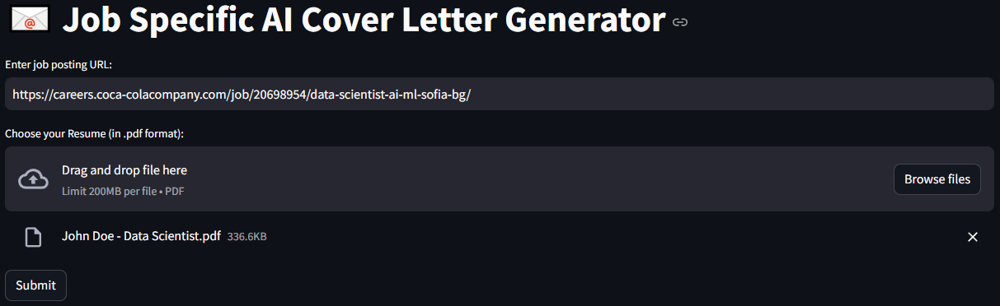
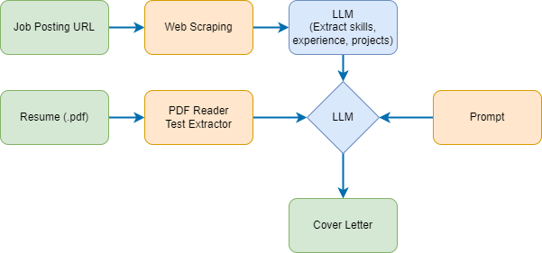

# 📧 Job Specific AI Cover Letter Generator
Job Specific personalized AI generated cover letter using groq, langchain and streamlit. 
1. User to input the URL of a job listing page. 
2. User to upload the resume in pdf format.
The tool then extracts job listings from that page and read uploaded resume and write a personlized cover letter based on job description and resume.
 



## Architecture Diagram


## Set-up
1. To get started, first create an API_KEY from here: https://console.groq.com/keys. Then update the `GROQ_API_KEY` inside `.env` with newly generated API_KEY. 

2. To get started, first install the dependencies using:
    ```commandline
     pip install -r requirements.txt
    ```
   
3. Run the streamlit app:
   ```commandline
   streamlit run main.py
   ```
   
**Additional Terms:**
This software is licensed under the MIT License. However, commercial use of this software is strictly prohibited without prior written permission from the author. Attribution must be given in all copies or substantial portions of the software.
